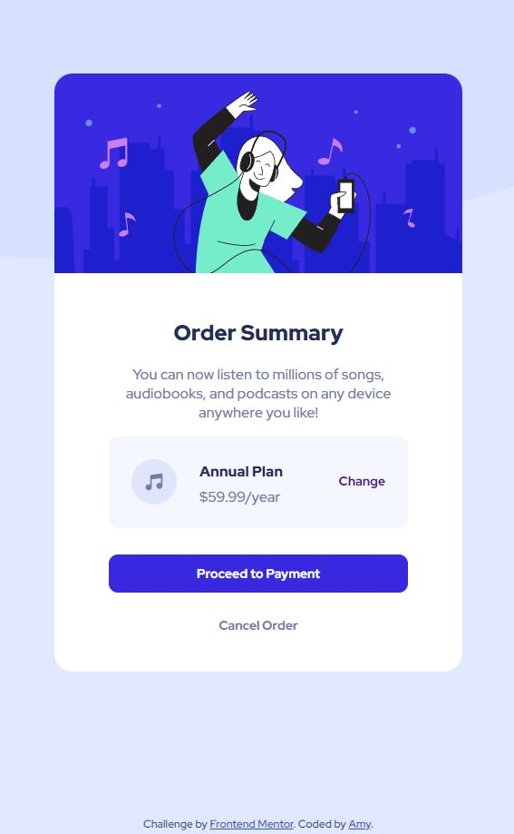

# Frontend Mentor - Order summary card solution

This is a solution to the [Order summary card challenge on Frontend Mentor](https://www.frontendmentor.io/challenges/order-summary-component-QlPmajDUj). Frontend Mentor challenges help you improve your coding skills by building realistic projects. 

## Table of contents

- [Overview](#overview)
  - [The challenge](#the-challenge)
  - [Screenshot](#screenshot)
  - [Links](#links)
- [My process](#my-process)
  - [Built with](#built-with)
  - [What I learned](#what-i-learned)
- [Author](#author)

## Overview

### The challenge

Users should be able to:

- See hover states for interactive elements

### Mobile Version Screenshot

### Links

- Solution URL: [https://github.com/MightyKale/order-summary](https://your-solution-url.com)
- Live Site URL: [https://mightykale.github.io/order-summary/](https://your-live-site-url.com)

## My process
Spent almost 3 hours for my second project, which is longer than I think it should. I spent most of the time fixing the background image (which I still think looks wrong) and the positioniong of the ordered item (ie. Annual Plan, Price, Icon and the 'change button'). I used absolute position for elements there, but I believe there should be an easier way for that (maybe grid?). I will look into that after. 

I've created my html based on the kind suggestions from @ChamuMutezva for my last project to use sematic elements, I hope I used them correctly.

### Built with

- HTML and CSS

### What I learned

Practiced more on creating the big structure. I also learned about background image related CSS styling.

## Author

- Website - [Amy Chu](www.linkedin.com/in/amy-chu-xiaoxiao)
- Frontend Mentor - [@MightyKale](https://www.frontendmentor.io/profile/MightyKale)
